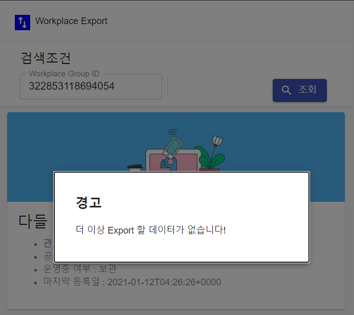

# [Workplace Export](https://github.com/lahuman/workplace_export)


> 워크플레이스의 관리자 패널에서는 특정 그룹의 게시글을 export를 제공하지 않습니다.
> 이 프로젝트는 Workplace의 특정 그룹의 게시글을 다운 받는 기능을 제공합니다.
한번에 다운받을 게시글의 수는 .env에서 변경이 가능합니다. 너무 큰 숫자의 경우 Workplace 서버에서 오류가 발생할 수 있습니다.
(권장: 100, 최대 : 500, 테스트에서는 1000도 가능하였으나, 오류가 간간히 발생했습니다.)
workplace 게시글 + 댓글을 xlsx 형식으로 다운로드 합니다.

> Workplace's admin panel does not provide export of specific group posts.
> This project provides the ability to download posts from specific Workplace groups.
The number of posts to download at one time can be changed in .env. If the number is too large, there may be an error with the Workplace server.
(Recommended: 100, Max: 500, 1000 is also possible in the test, but an error occurs intermittently.)
Download work posts + comments in xlsx format.

***Screen***

#### 그룹 정보 조회
- 그룹 ID를 기준으로 그룹 정보가 표기


#### 1번째 이후 게시글 다운로드 시
- 게시글 다운로드 **다음** 으로 UI 변경


#### 모든 게시글 다운로드 시 
- 알림 표기



#### 잘못된 그룹 ID 입력시


#### 결과 예제

<a href="https://raw.githubusercontent.com/lahuman/workplace_export/main/322853118694054_1.xlsx" download>Export XLSX Example</a>

## Table of Contents 

> 설치 & 설정 & 정보

- [Installation](#Installation)
- [Workplace](#Workplace)
- [History](#History)
- [License](#License)

---

## Installation

- 설치를 위해서는 기본적으로 NODEJS 14.x 이상의 버젼이 필요합니다.

### Backend

- [nestjs](https://nestjs.com/) 기반으로 작성되었습니다.
- PATH : **backend**

> .env 설정은 _env 파일을 .env로 변경하여서 Key에 알맞은 값을 설정 하면 됩니다.
또는 아래 샘플을 이용하셔요.
WP_TOKEN는 workplace 관리자 화면에서 생성한 맞춤 통합의 토큰 값입니다
해당 통합은 게시물, 댓글 사용자의 정보를 조회하는 권한을 주어야 합니다.

```
NODE_ENV=deployment
PORT=3000
WP_GRAPH_URL=https://graph.facebook.com
WP_TOKEN= # workplace Token 발급 필요
DEFAULT_LIMIT=100
```

> 실행

```
$ npm install
$ npm run start
```

서버가 문제 없이 기동이 되면 [Swagger UI](http://localhost:3000/docs)을 확인하세요.

### Frontend

- [ReactJS](https://reactjs.org/)로 작성되어 있습니다.
- PATH : **frontend**

> .env 설정은 _env 파일을 .env로 변경하여서 Key에 알맞은 값을 설정 하면 됩니다.
또는 아래 샘플을 이용하셔요.

```
REACT_APP_API=http://localhost:8080 # API SERVER 주소 
REACT_APP_WORKPLACE=https://{domain}.workplace.com # workplace 주소
REACT_APP_LIMIT=100 # 게시글 다운수 (backend와 같은 수 화면 표기용)
```

> 실행 

```
$ npm install
# npm run start
```

## [Workplace](https://work.workplace.com/) 

> [Workplace](https://work.workplace.com/)은 페이스북에서 개발한 엔터프라이즈 연결 플랫폼입니다. 
그룹 사용, 인스턴스 메시징 및 뉴스 피드를 포함합니다.

게시물의 반응을 확인하기 위해서 관리자 페이지에서 맞춤 통합을 생성해야 합니다.


통합 생성후 다음 3개의 통합 권한(그룹 콘텐츠 읽기(필수), 사용자 이메일 읽기(옵션), 그룹 멤버 읽기(옵션))을 할당해야 합니다.


---

## History

- v1.0 : workplace Export

---

## License

[](http://badges.mit-license.org)

- **[MIT license](http://opensource.org/licenses/mit-license.php)**
- Copyright 2020 © <a href="https://lahuman.github.io" target="_blank">lahuman</a>.
